# Steve's Army -- Architecture Documentation

> **Mod ID:** `steves_army`  
> **Minecraft:** 1.20.1 Forge (Parchment mappings)  
> **Entrypoint:** `StevesArmyMod.java`  
> **Dependency:** TaCZ (optional, via reflection)

---

## Table of Contents

1. [Module Overview & Goal Priority](#1-module-overview--goal-priority)
2. [Cover System](#2-cover-system)
3. [Peek System](#3-peek-system)
4. [Suppression System](#4-suppression-system)
5. [Soldier Combat Goal](#5-soldier-combat-goal)
6. [Cover Tactical Goal](#6-cover-tactical-goal)
7. [Squad System](#7-squad-system)
8. [Detection System](#8-detection-system)
9. [Threat Awareness](#9-threat-awareness)
10. [Gun Integration](#10-gun-integration)
11. [Entity Hierarchy](#11-entity-hierarchy)
12. [Ping System](#12-ping-system)
13. [Network Layer](#13-network-layer)
14. [Key Bindings & Client](#14-key-bindings--client)
15. [Suppression Fire Lifecycle](#15-suppression-fire-lifecycle)

---

## 1. Module Overview & Goal Priority

### Goal Registration Order

#### Friendly `SoldierEntity`
```
Priority | Goal
---------|-----------------------------------------------------
0        | FloatGoal
1        | SoldierMoveToPingGoal        (ping-driven movement)
2        | CoverTacticalGoal            (cover seeking/staying)
3        | SoldierFollowOwnerGoal       (FOLLOW mode)
3        | SoldierHoldPositionGoal      (HOLD mode)
4        | SoldierCombatGoal            (targeting, shooting, suppression)
5        | SoldierStrollGoal            (idle wander)
6        | LookAtPlayerGoal
7        | RandomLookAroundGoal
```

#### Enemy `EnemySoldierEntity`
```
Priority | Goal
---------|-----------------------------------------------------
0        | FloatGoal
1        | CoverTacticalGoal            (cover seeking/staying)
2        | SoldierCombatGoal            (targeting, shooting, suppression)
3        | EnemyDefendGoal              (defend spawn position)
4        | LookAtPlayerGoal
5        | RandomLookAroundGoal
```

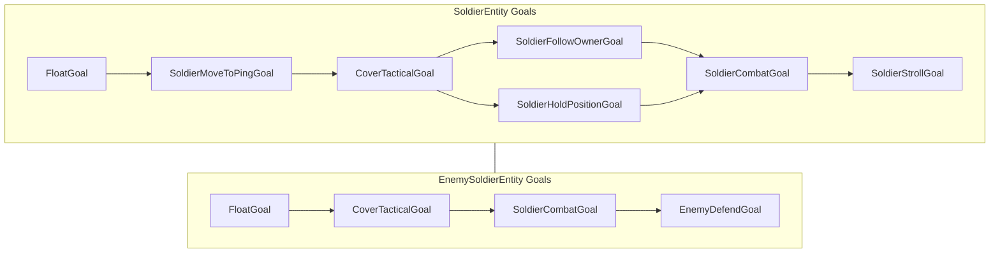

### Key: `SoldierMoveToPingGoal` has higher priority than cover. A soldier with a valid ping move target will **not** seek cover until the ping expires.

### Entrypoint Flow

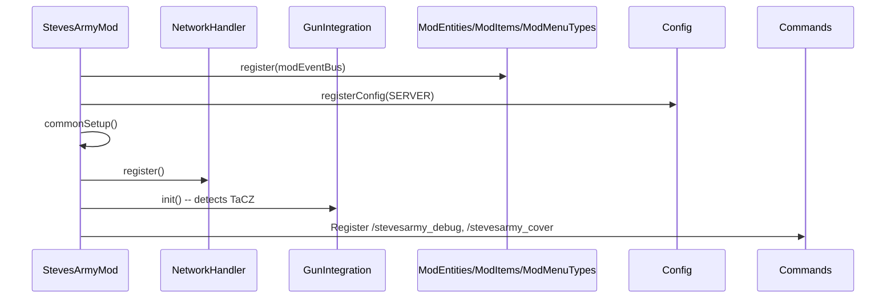

---

## 2. Cover System

**Package:** `com.stevesarmy.combat.cover`

The cover system is the core tactical AI module. It consists of several single-responsibility classes.

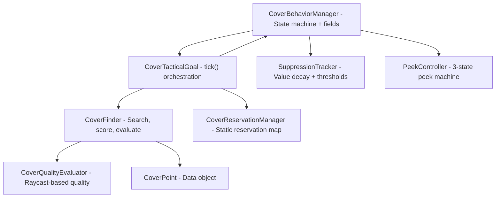

### 2.1 Cover State Machine

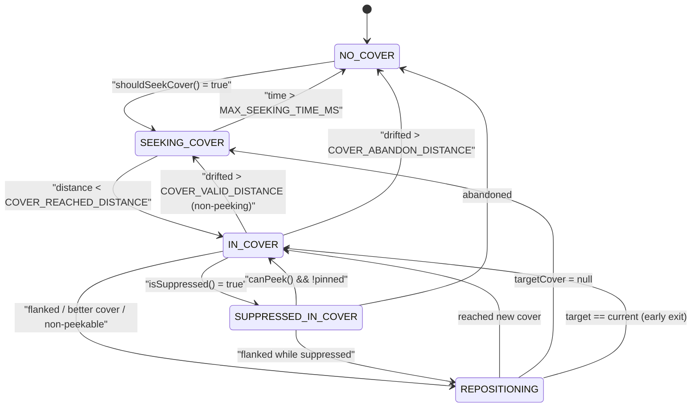

### 2.2 Cover Scoring Weights

Calculated in `CoverFinder.calculateThreatAwareScore()`

| Component | Weight | Description |
|-----------|--------|-------------|
| PRIMARY_PROTECTION_WEIGHT | 0.25 | Protection from primary threat direction |
| FIRING_QUALITY_WEIGHT | 0.20 | Ability to fire toward threat while protected |
| FLANKING_PROTECTION_WEIGHT | 0.15 | Protection from multiple threats |
| PEEK_ANGLE_WEIGHT | 0.15 | LOS availability from adjacent peek positions |
| SQUAD_DISPERSION_WEIGHT | 0.12 | Spread out from squadmates |
| DISTANCE_WEIGHT | 0.10 | Proximity to search center |
| FORMATION_POSITION_WEIGHT | 0.08 | Match formation ideal position |
| `FIGHTABILITY_BONUS` (additive) | +0.25 (HALF) / +0.15 (FULL) | Added if `canShootFrom()` |
| `blindPenalty` (subtractive) | -0.50 | Full cover with no peek angle to target |

### 2.3 Cover Height Classification

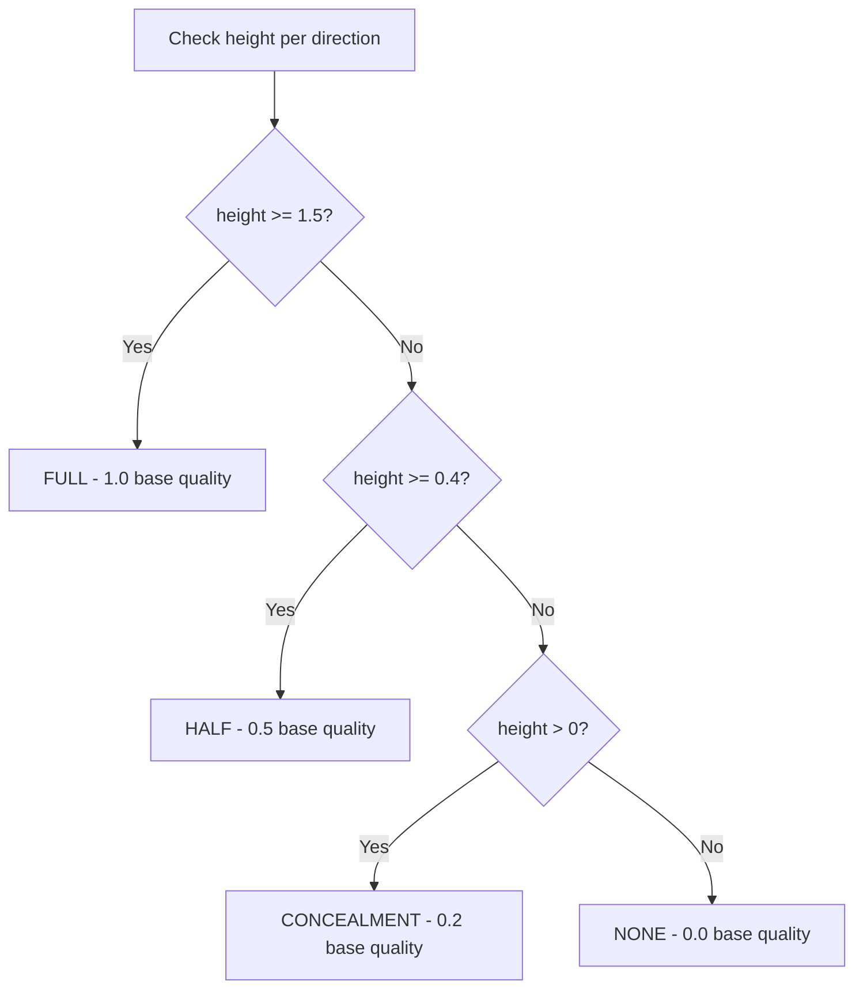

Blocks excluded from valid cover: `IronBarsBlock`, `GlassBlock`, `StainedGlassBlock`, `TintedGlassBlock`.

### 2.4 Cover Quality Evaluator (Raycast)

`CoverQualityEvaluator` casts 8 standing-height rays + 4 crawl-height rays from the cover position toward the threat's eye position:

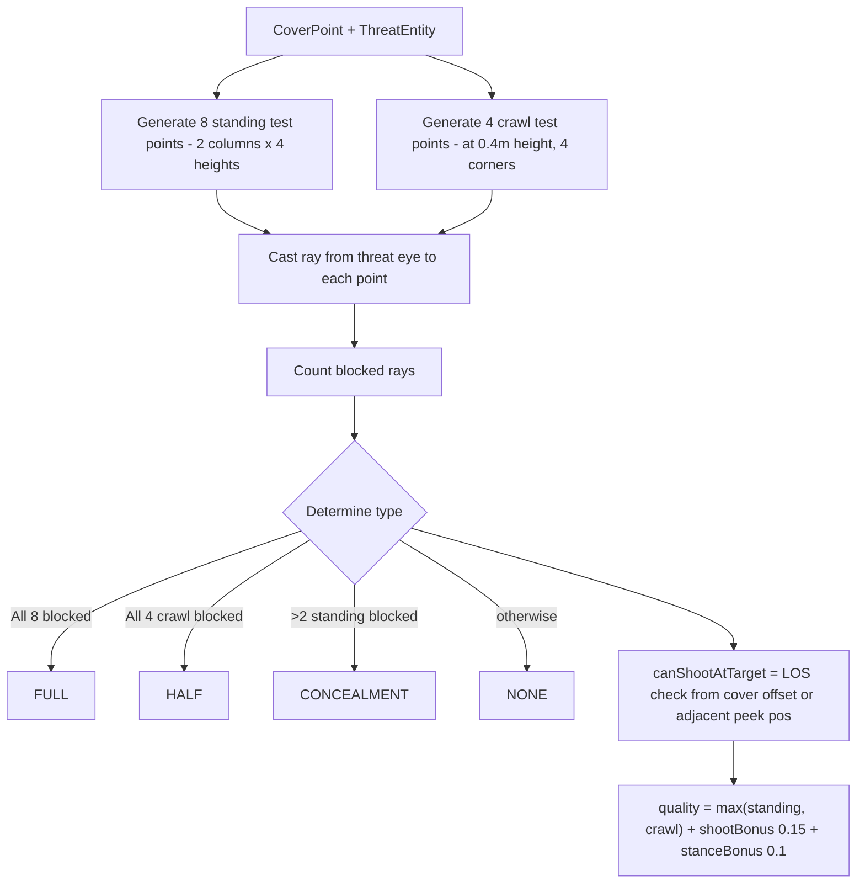

### 2.5 Cover Finder

**Search:** Inside-out spiral search over `SEARCH_OFFSETS` (pre-calculated, sorted by distance squared). Radius = 12 blocks, max 50 cover points.

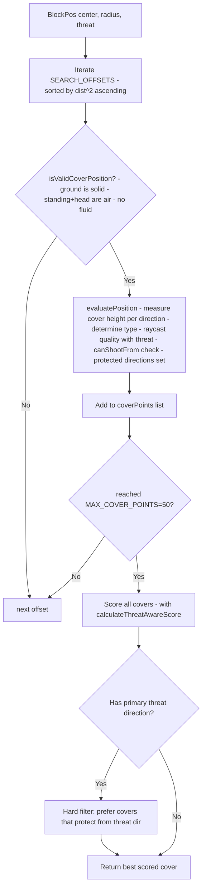

### 2.6 Cover Reservation Manager

- Static `ConcurrentHashMap<BlockPos, Set<UUID>>` -- thread-safe reservations
- `MAX_RESERVATIONS_PER_COVER = 1` (one soldier per cover)
- `RESERVATION_TIMEOUT_MS = 30000` (auto-cleanup)
- Released on `clearCover()` or `clearTargetCover()`
- Blacklist system in `CoverTacticalGoal` with reasons: `PATH_FAILED`, `STUCK_SEEKING`, `STUCK_REPOSITIONING`
- Blacklist cleared every 15s

### 2.7 Peek Count Penalty

After 4 peeks from the same cover, a quality penalty is applied:
```
extraPeeks = peekCount - PEEK_COUNT_PENALTY_THRESHOLD + 1  // (4)
penalty = min(MAX_COVER_PENALTY(0.60), extraPeeks * 0.15)
```

This penalty is fed back into the hysteresis check when evaluating better cover.

---

## 3. Peek System

**File:** `entity/ai/PeekController.java`

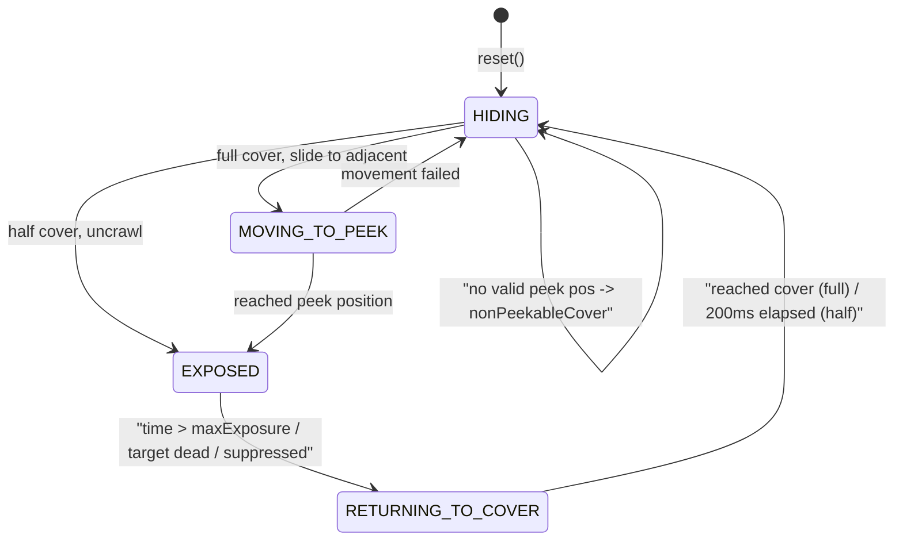

### 3-state Peek Flow

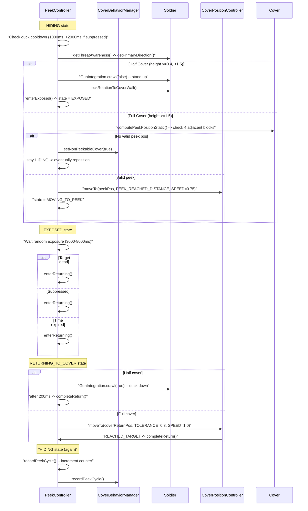

### Timing Constants

| Constant | Value | Purpose |
|----------|-------|---------|
| EXPOSURE_TIME_MIN_MS | 3000 | Minimum exposure |
| EXPOSURE_TIME_MAX_MS | 8000 | Maximum exposure |
| DUCK_COOLDOWN_MS | 1000 | Min time between peeks |
| SUPPRESSED_HIDE_EXTRA_MS | 2000 | Extra hide when suppressed |
| PEEK_REACHED_DISTANCE | 0.05 | Distance threshold for "reached" |
| PEEK_SPEED | 0.75 | Velocity slide speed to peek |
| RETURN_SPEED | 1.0 | Velocity slide speed returning |
| NON_PEEKABLE_REPOSITION_TICKS | 60 | Ticks before reposition (~3s) |

### Full Cover Peek Mechanics

- Soldier velocity-slides 1 block sideways to an adjacent standable position
- Position is validated: ground solid, standing+head air, not fluid
- LOS is validated from the peek position (direct ray to target, then cone fallback)
- On return, slides back to original cover position
- Half-cover: instant state change, soldier uncrawls/crawls

---

## 4. Suppression System

### 4.1 SuppressionTracker (`combat/cover/SuppressionTracker.java`)

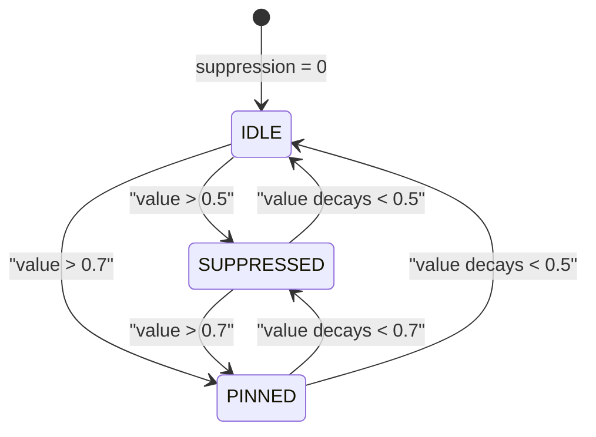

**Decay:**
- `DECAY_RATE = 0.15` base per tick
- `decayMultiplier = 2.0` when in cover, 1.0 when not
- Applied as: `decay = 0.15 x decayMultiplier x 0.05 = 0.0075/tick (in cover)`
- `peakSlowdown`: higher peak suppression = slower decay (1.0 peak -> 50% decay speed)

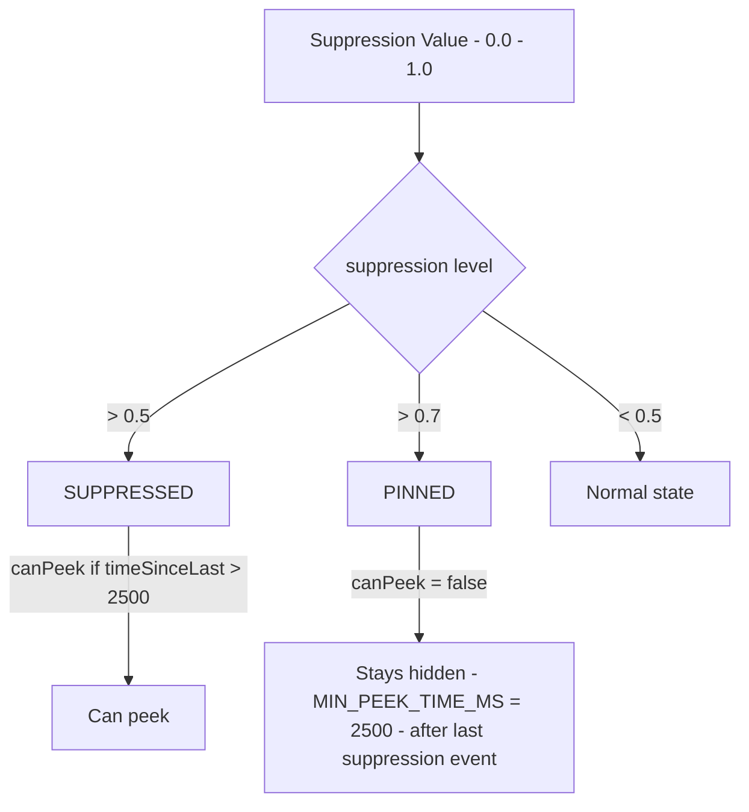

**Suppression sources:**

| Source | Base Value | Multipliers |
|--------|-----------|-------------|
| Near miss (<3 blocks) | 0.25 | distanceFactor x speedMultiplier x burstMultiplier |
| Direct incoming fire | 0.30 | speedMultiplier |
| Damage taken | 0.50 | -- |

**Burst suppression decay:** `burstMultiplier = 1.0 - min(burstCount - 1, 3) x 0.15`
- First hit: 1.0x, Second hit: 0.85x, Third: 0.70x, Fourth+: 0.55x

### 4.2 IncomingFireHandler (`combat/cover/IncomingFireHandler.java`)

- `@SubscribeEvent onLivingHurt`: calls `coverManager.onTakeDamage()` and `coverManager.onIncomingFire()` for all SoldierEntity damage
- `@SubscribeEvent onEntityJoin`: tracks `EntityKineticBullet` entities
- `tick()`: for each tracked bullet, computes line segment between previous and current position, then `checkNearMissLineSegment()` against all nearby soldiers within NEAR_MISS_THRESHOLD (3 blocks)
- `@SubscribeEvent onLivingDeath`: propagates death to `SquadThreatIntel.markThreatDead()` and each squad member's `SoldierCombatGoal.onTargetKilledByTeammate()`

### 4.3 Suppression Fire Integration

See [Section 15: Suppression Fire Lifecycle](#15-suppression-fire-lifecycle).

---

## 5. Soldier Combat Goal

**File:** `entity/ai/SoldierCombatGoal.java`

### Main Tick Flow

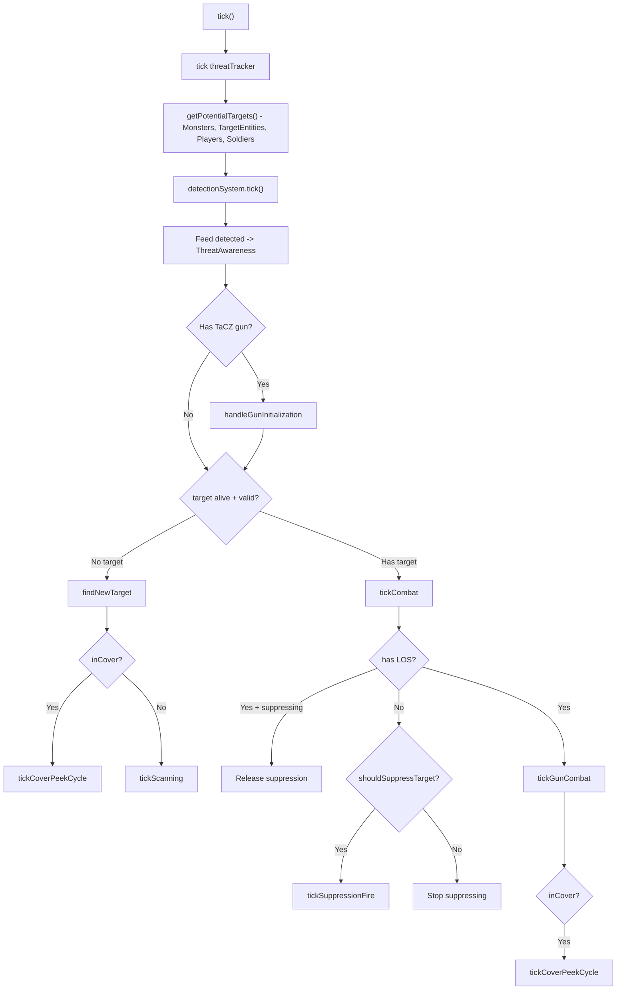

### Shooting Mechanics (`tickGunCombat`)

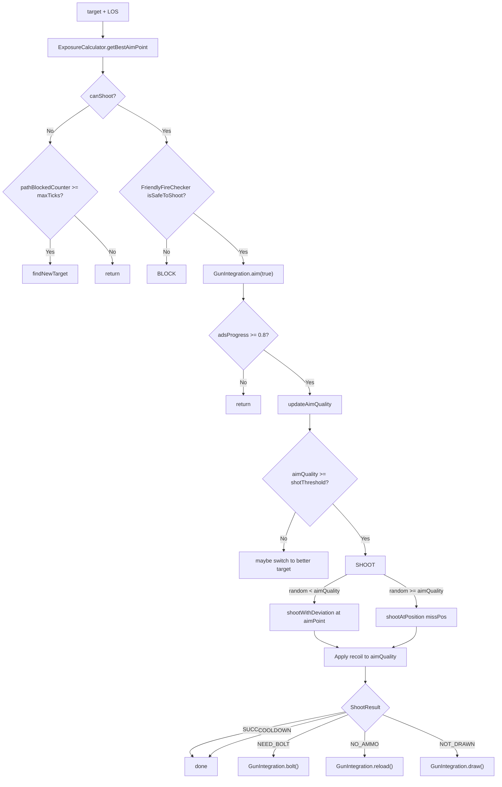

### Target Acquisition Priority (`findNewTargetInternal`)

1. **Forced target** (from SEND ping) -> nearest entity within 20 blocks with LOS
2. **Ping threat** (ENEMY ping) -> nearest entity within 20 blocks with LOS
3. **Any LOS target** -> highest hit probability
4. **Threat-direction fallback** -> entity closest to primary threat direction
5. **Last known position** -> entity nearest to last known position (20 block radius)
6. **Closest entity** -> nearest entity regardless of LOS

### Aim Quality

- Builds toward `targetAimQuality` via lerp with `buildRate`
- Decays when moving (own movement), when target moves, or when LOS is lost
- Shot threshold = `targetAimQuality x thresholdScale` (min 0.15)
- Slower guns (manual bolt) use a higher `thresholdScale`

---

## 6. Cover Tactical Goal

**File:** `entity/ai/CoverTacticalGoal.java`

### Full State Machine + Decision Flow

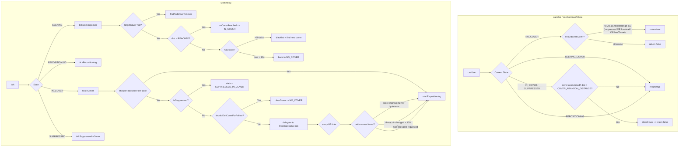

### Cover Search Center Selection (`findAndMoveToCover`)

```mermaid
flowchart TD
    IN["threatDirection - threatList - squadCtx"] --> MODE{Mode}
    MODE -->|HOLD| HOLD["searchCenter = holdPosition - radius = 12"]
    MODE -->|FOLLOW + suppressed| FOLL1["searchCenter = soldierPos - radius = 12"]
    MODE -->|FOLLOW + not suppressed| FOLL2["searchCenter = ownerPos - radius = 15"]
    MODE -->|Enemy (no owner)| ENEMY["searchCenter = soldierPos - radius = 12"]
    HOLD --> C1[CoverFinder.findBestCover - with squadCtx]
    FOLL1 --> C1
    FOLL2 --> C1
    ENEMY --> C1
    C1 --> FOUND{"result present?"}
    FOUND -->|No| C2["fallback: findBestCover - without squadCtx"]
    C2 --> C3["fallback: findBestCover - without squadCtx at all"]
    FOUND -->|Yes| RESERVE{"CoverReservationManager.reserve?"}
    RESERVE -->|Success| MOVE[moveToCover via PathNavigation]
    RESERVE -->|Failed| DONE[return]
```

### Path Navigation to Cover (`moveToCover`)

```mermaid
flowchart TD
    IN[CoverPoint wallPos] --> PATH["navigation.createPath - to standing position"]
    PATH --> REACH{"path.canReach()?"}
    REACH -->|Yes| NAV["navigation.moveTo(path, 1.2)"]
    REACH -->|No, but nodes exist| CHECK{"endpoint dist^2 <= 4 && yDiff <= 1?"}
    CHECK -->|Yes| NAV
    CHECK -->|No| FAIL{"path == null && not retry?"}
    REACH -->|No nodes| FAIL
    FAIL -->|Yes| RETRY["save as pendingRetryCover -> retry next tick"]
    FAIL -->|No (already retried)| BLACK["blacklistCover -> PATH_FAILED"]
```

### Hysteresis for Cover Switching

When evaluating better cover while IN_COVER:
```
hysteresisFactor = penalty > 0 ? 1.0 : 1.0 + HYSTERESIS_THRESHOLD(0.35)
currentScore = currentCover.quality x hysteresisFactor - penalty
newScore = newCover.quality
switch if: newScore > currentScore
```

This means a new cover must be at least 35% better to justify switching, unless the current cover has a peek-count penalty.

---

## 7. Squad System

**Package:** `com.stevesarmy.squad`

### 7.1 SquadData

```
SquadData {
    UUID squadId           -- unique squad identifier
    UUID leaderId          -- owner UUID or 0000...0001 for enemies
    List<UUID> memberIds   -- soldier UUIDs
    SquadMode mode         -- FOLLOW or HOLD
    SquadFormation formation -- NONE, LINE, WEDGE, COLUMN, DIAMOND, CQB
    boolean cqbMode        -- close-quarters battle mode flag
    SquadThreatIntel threatIntel -- shared threat knowledge
}
```

### 7.2 SquadManager (SavedData)

- Stored as `steves_army_squads` in dimension data
- Three maps: `squadsByLeader`, `squadsByMember`, `squadsById`
- Key methods: `createSquad`, `addMemberToSquad`, `removeMemberFromSquad`, `disbandSquad`, `setSquadFormation`, `setSquadCQB`

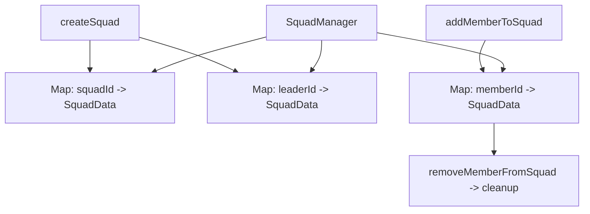

### 7.3 Squad Cover Context

`SquadCoverContext` record:
```java
record SquadCoverContext(
    boolean inSquad,
    SquadFormation formation,
    int squadSize,
    int memberIndex,
    List<BlockPos> occupiedCovers,
    List<Vec3> squadThreatDirections
)
```

Used by `CoverFinder` to:
- Apply `SQUAD_DISPERSION_WEIGHT` (0.12): penalize covers too close (<4 blocks) to squadmates
- Apply `FORMATION_POSITION_WEIGHT` (0.08): reward covers near the ideal formation offset

### 7.4 SquadFormation

| Formation | Color | Use |
|-----------|-------|-----|
| NONE | White | Default, no formation effect |
| LINE | Green | Soldiers spread horizontally |
| WEDGE | Blue | V-shaped, forward-oriented |
| COLUMN | Orange | Single-file line |
| DIAMOND | Magenta | Diamond pattern |
| CQB | Red | Close-quarters, overrides cover seeking |

### 7.5 Squad Modes

```
SquadMode.FOLLOW -- soldier follows owner, seeks cover near owner
SquadMode.HOLD   -- soldier holds position, seeks cover near hold pos
```

### 7.6 SquadThreatIntel

- Shared threat knowledge for the squad (stored in `SquadData`)
- Each `ThreatKnowledge` tracks: position, last seen time, reporter, accuracy, alive/dead, suppression state
- Threats remembered for `THREAT_MEMORY_TICKS = 600` (30s)
- Stale check: `STALE_TIMEOUT_TICKS = 60` (3s) for suppression assignment eligibility
- Suppression heartbeat timeout: 10 ticks -- if suppressor doesn't heartbeat, assignment is cleared

---

## 8. Detection System

**File:** `combat/DetectionSystem.java`

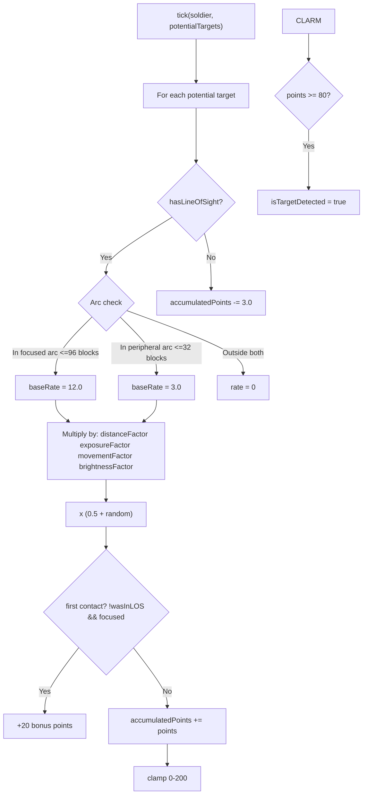

### Detection Arcs

| Arc | Range | Rate | Angle |
|-----|-------|------|-------|
| **Focused** | 96 blocks | 12.0 pts/tick | +/-45 deg from look direction |
| **Peripheral** | 32 blocks | 3.0 pts/tick | +/-90 deg from look direction (excl. focused) |

### Detection Factors

| Factor | Range | Notes |
|--------|-------|-------|
| Distance | 0.0-1.0+ | 1.0 at 16 blocks, drops quadratically beyond |
| Exposure | 0.0-1.0 | From `ExposureCalculator` (% of body visible) |
| Movement | 0.3-1.5 | Sprint=1.5, walk=1.0, sneak=0.3, still=0.7 |
| Brightness | 0.3-1.0 | `0.3 + 0.7 x sqrt(lightLevel / 15)` |

---

## 9. Threat Awareness

**File:** `combat/ThreatAwareness.java`

### Threat Sources

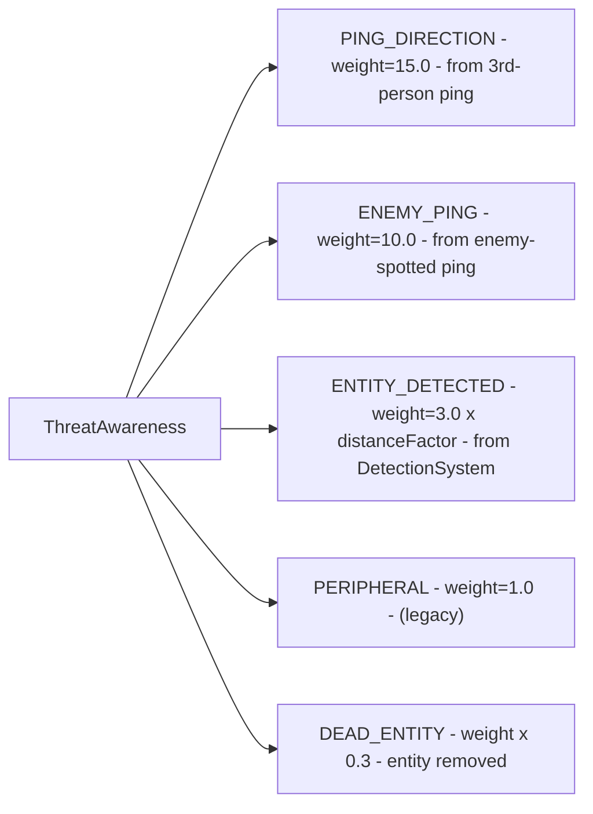

### Smooth Direction

- Updated via `updateSmoothDirection(threatPos)` with configurable `blendFactor`
- Decays after `threatSmoothDecayTimeMs` ms of no updates
- Used by `CoverTacticalGoal` for threat direction and peek direction

### Query Methods

| Method | Returns | Use Case |
|--------|---------|----------|
| `getPrimaryDirection(pos)` | Normalized Vec3 | Cover protection scoring |
| `getThreatDirectionForProactivePeek(pos)` | Vec3 or null | PeekController HIDING check |
| `getWeightedAveragePosition()` | Vec3 | Debug rendering, fallback targeting |
| `isBeingFlanked(pos)` | Boolean | Flank-driven repositioning |
| `getThreatCoverage(coverPos)` | 0.0-1.0 | Threat protection assessment |

---

## 10. Gun Integration

**File:** `combat/GunIntegration.java`

### Architecture

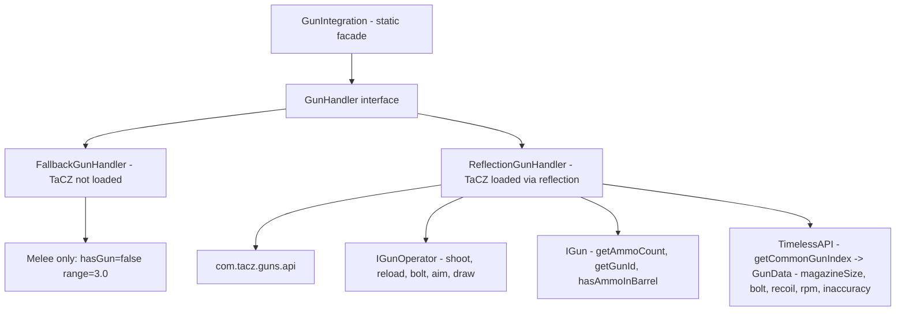

### Gun Operations (ReflectionGunHandler)

| Operation | Reflection Target | Notes |
|-----------|-----------------|-------|
| `hasGun(entity)` | `IGun.mainHandHoldGun` | -- |
| `shoot(shooter, target)` | `IGunOperator.shoot(pitch, yaw)` | Aim at entity center |
| `shootWithDeviation(shooter, aimPoint, ...)` | `IGunOperator.shoot(pitch, yaw)` | Uses `ExposureCalculator.AimPointResult`, with pitch/yaw deviation |
| `shootAtPosition(shooter, pos)` | `IGunOperator.shoot(pitch, yaw)` | Aim at arbitrary Vec3 |
| `reload(entity)` | `IGunOperator.reload` | Checks ammo, logs |
| `bolt(entity)` | `IGunOperator.bolt` | -- |
| `aim(entity, isAiming)` | `IGunOperator.aim(boolean)` | -- |
| `crawl(entity, isCrawl)` | `IGunOperator.crawl` | Also sets soldier `setCrawling(boolean)` -> `Pose.SWIMMING` |
| `initialData(entity)` | `IGunOperator.initialData` | Initialize TaCZ gun data |
| `draw(entity)` | `IGunOperator.draw(ItemStack)` | Draw gun (skipped if reloading) |

### ShootResult Mapping

| TaCZ Enum | Mapped Result |
|-----------|--------------|
| `SUCCESS` | SUCCESS |
| `NO_AMMO` | NO_AMMO |
| `COOL_DOWN` | COOLDOWN |
| `NEED_BOLT` | NEED_BOLT |
| `IS_BOLTING` | IS_BOLTING |
| `IS_RELOADING` | IS_RELOADING |
| `IS_DRAWING` | IS_DRAWING |
| `NOT_DRAW` | NOT_DRAWN |
| `NOT_GUN` | NOT_GUN |

### Ammo Management

- Ammo is consumed from the 9-slot soldier inventory
- `useInventoryAmmo()` checks TaCZ gun data config
- When magazine is empty, `SoldierCombatGoal` auto-reloads
- `EnemySoldierEntity.refillAmmo()` refills to full every tick (infinite ammo for enemies)

### Accuracy Values (InaccuracyType)

```
STAND = 5.0
MOVE  = 5.75
SNEAK = 3.5
LIE   = 2.5
AIM   = 0.15
```
Soldiers aim before shooting (ADS, `aimProgress >= 0.8` or `0.5` for suppression).

---

## 11. Entity Hierarchy

```mermaid
classDiagram
    PathfinderMob <|-- SoldierEntity
    SoldierEntity <|-- EnemySoldierEntity
    SoldierEntity : SoldierCombatGoal combatGoal
    SoldierEntity : CoverBehaviorManager coverBehaviorManager
    SoldierEntity : PeekController peekController
    SoldierEntity : ThreatAwareness threatAwareness
    SoldierEntity : SoldierInventory inventory
    SoldierEntity : UUID squadId
    SoldierEntity : SquadFormation squadFormation
    SoldierEntity : BlockPos pingMoveTarget
    SoldierEntity : BlockPos pingThreatPos
    SoldierEntity : boolean cqbMode
    
    class EnemySoldierEntity {
        +BlockPos defendPosition
        +double DEFEND_RADIUS = 20.0
        +void refillAmmo()
        +void ensureEnemySquadMembership()
    }
```

### SoldierEntity Key Features

- **Move control:** `CoverPositionController` (custom, handles velocity-based peek sliding)
- **Navigation:** `SoldierGroundNavigation` (custom ground nav)
- **Inventory:** 9-slot `SoldierInventory` (1 main hand + 1 armor slots + 7 general)
- **Data syncing:** 18+ `EntityDataAccessor` fields for cover state, peek state, suppression, threat direction, debug data -- all synced from server to client for HUD rendering
- **Friendly fire check:** `isFriendlyTo()` -- same owner = friendly

### EnemySoldierEntity Extras

- No `SoldierMoveToPingGoal` (no ping guidance)
- No follow/hold goals -- uses `EnemyDefendGoal` to stay near spawn
- Auto-joins enemy squad (leader UUID = `00000000-0000-0000-0000-000000000001`)
- Auto-refills ammo every tick (infinite)
- `canAttack()` returns false for other `EnemySoldierEntity` instances

---

## 12. Ping System

**Package:** `com.stevesarmy.ping`

### Ping Types

| Type | Color | Behavior on Soldier |
|------|-------|---------------------|
| `SEND` | `#55AAAA` | Sets hold position, clears cover, dispatches soldier |
| `GO_TO` | `#55FF55` | Sets ping move target, switch to HOLD |
| `THREAT_DIRECTION` | `#FF8800` | Sets threat direction + forced target pos |
| `LOCATION` | `#5555FF` | No-op (visual only) |
| `FOLLOW` | `#55FFFF` | Switch to FOLLOW, clear all threats |
| `HOLD` | `#FFAA00` | Switch to HOLD at current pos, clear threats |

### Ping Flow

```mermaid
sequenceDiagram
    Participant Player as Player (Client)
    Participant Wheel as PingWheelScreen
    Participant Network as NetworkHandler
    Participant Server as Server
    Participant Soldier as SoldierEntity

    Player->>Wheel: "Middle Mouse -> open wheel"
    Player->>Wheel: "Select type + click pos"
    Wheel->>Network: "PingMessage (type, pos, author)"
    Network->>Server: handle(pingMessage)
    Server->>Network: "PingBroadcastMessage (to all players)"
    Server->>Soldier: "receivePing(type, pos)"
    Soldier->>Soldier: switch based on type

    alt THREAT_DIRECTION
        Soldier->>Soldier: "threatAwareness.onPingDirection(pos)"
        Soldier->>Soldier: "pingThreatPos = pos (20s TTL)"
        Soldier->>Soldier: "forcedTargetPos = pos (10s TTL)"
    else GO_TO / SEND
        Soldier->>Soldier: "pingMoveTarget = pos (15s TTL)"
        Soldier->>Soldier: "setSquadMode(HOLD)"
    else FOLLOW / HOLD
        Soldier->>Soldier: clear threat data
        Soldier->>Soldier: "setSquadMode(FOLLOW or HOLD)"
    end
```

### PingManager (Client-side)

- Stores active pings with 7-second lifetime
- Updates screen positions each frame via `MathUtils.worldToScreen()`
- Scale formula: `2.0 / pow(distance, 0.3)`, clamped to [0.5, 2.0]

---

## 13. Network Layer

**Package:** `com.stevesarmy.network`

### Packet Registry

| ID | Packet | Direction | Purpose |
|----|--------|-----------|---------|
| 0 | `ToggleSquadModeMessage` | C->S | Toggle soldier FOLLOW/HOLD mode |
| 1 | `DebugMessage` | C->S | Toggle debug logging |
| 2 | `OpenSoldierInventoryMessage` | C->S | Request to open soldier inventory |
| 3 | `PingMessage` | C->S | Player sends a ping |
| 4 | `PingBroadcastMessage` | S->C | Broadcast ping to all players |
| 5 | `PotentialTargetsDebugMessage` | S->C | Debug data for HUD |
| 6 | `FormationMessage` | C->S | Set squad formation |
| 7 | `SyncSoldierInventoryPacket` | S->C | Sync inventory to client for screen |
| 8 | `CQBToggleMessage` | C->S | Toggle CQB mode for squad |

```mermaid
sequenceDiagram
    Participant Client
    Participant Server
    Participant Soldier

    Note over Client,Server: Player-initiated
    Client->>Server: ToggleSquadModeMessage
    Server->>Soldier: "setSquadMode()"

    Client->>Server: FormationMessage
    Server->>SquadManager: "setSquadFormation()"

    Client->>Server: CQBToggleMessage
    Server->>SquadData: "setCQB()"

    Client->>Server: PingMessage
    Server->>Soldier: "receivePing(type, pos)"
    Server->>Client: "PingBroadcastMessage (to all)"

    Note over Client,Server: Debug
    Client->>Server: DebugMessage
    Server->>CoverTacticalGoal: "setDebugLogging()"

    Note over Client,Server: "Server -> Client"
    Server->>Client: PotentialTargetsDebugMessage
    Client->>ClientHUD: Update overlay

    Server->>Client: SyncSoldierInventoryPacket
    Client->>Screen: Update GUI
```

---

## 14. Key Bindings & Client

**Package:** `com.stevesarmy.client`

| Key | Mapping | Handler | Action |
|-----|---------|---------|--------|
| G | `FORMATION_WHEEL` | `ClientInputHandler` | Opens formation wheel (squad mode selector) |
| H | `DEBUG` | `ClientInputHandler` | Toggles debug HUD overlay |
| Middle Mouse | `PING_WHEEL` | `PingWheelHandler` | Opens ping radial wheel |

```mermaid
flowchart TD
    G[G key pressed] --> FH[FormationWheelHandler]
    FH --> FW[FormationWheelRenderer]
    FW --> SELECT{Selected option}
    SELECT -->|Toggle mode| TSM["ToggleSquadModeMessage -> Server"]
    SELECT -->|Set formation| FM["FormationMessage -> Server"]
    SELECT -->|Toggle CQB| CQB["CQBToggleMessage -> Server"]

    H[H key pressed] --> KH[KeyInputHandler]
    KH --> DH["DebugMessage -> Server"]

    MM[Middle Mouse] --> PW[PingWheelHandler]
    PW --> PWR[PingWheelRenderer]
    PW --> PING_SELECT{Selected ping type}
    PING_SELECT -->|Click world pos| PM["PingMessage -> Server"]
```

### Client Renderers

| Renderer | Purpose |
|----------|---------|
| `CombatDebugRenderer` | Target lines, detection arcs, locked target markers |
| `CoverDebugRenderer` | Cover points, scoring, peek candidates |
| `CoverHudRenderer` | Soldier cover state overlay |
| `PingOverlayRenderer` | World-space ping markers |
| `PingWheelRenderer` | Radial wheel UI |
| `FormationWheelRenderer` | Squad mode/formation radial UI |

---

## 15. Suppression Fire Lifecycle

This section ties together `SoldierCombatGoal`, `SquadThreatIntel`, and `SuppressireAssignmentManager`.

```mermaid
stateDiagram-v2
    [*] --> IDLE
    IDLE --> EVALUATING: "tick() -> target not reachable"
    EVALUATING --> IDLE: has LOS to primary target
    EVALUATING --> CLAIMING: "shouldSuppressTarget() = true"
    CLAIMING --> CLAIMING: "tryMarkThreatSuppressed()"
    CLAIMING --> IDLE: all threats already suppressed
    CLAIMING --> SUPPRESSING: claim succeeded
    SUPPRESSING --> SUPPRESSING: tick suppression fire
    
    state SUPPRESSING {
        [*] --> AIMING
        AIMING --> WAITING_ADS: "aim() called"
        WAITING_ADS --> FIRING: "adsProgress >= 0.5"
        
        state FIRING {
            [*] --> BURSTING
            BURSTING --> BURSTING: "fire burst shot - burstShotsFired++"
            BURSTING --> COOLDOWN: "burstShotsFired >= 3"
            COOLDOWN --> BURSTING: "cooldown expired (0.8s)"
            BURSTING --> RELOADING: out of ammo
            RELOADING --> BURSTING: reload complete
        }
        
        FIRING --> MAINTAINING: "remaining ticks > 0"
        MAINTAINING --> FIRING: continue burst cycle
    }
    
    SUPPRESSING --> IDLE: "suppressionRemainingTicks <= 0"
    SUPPRESSING --> IDLE: "LOS to suppression target lost (with 2-block tolerance)"
    SUPPRESSING --> IDLE: gained LOS to primary target
    SUPPRESSING --> IDLE: "heartbeat timeout (10 ticks) -> SuppressireAssignmentManager clears"
    SUPPRESSING --> IDLE: threat killed by teammate
```

### Suppression Fire Constants

| Constant | Value | Purpose |
|----------|-------|---------|
| SUPPRESSION_ADS_THRESHOLD | 0.5 | Minimum ADS progress to fire |
| SUPPRESSION_MAX_RANGE | 30.0 | Max distance to suppression target |
| SUPPRESSION_LOS_TOLERANCE | 2.0 | Blocks of tolerance for LOS check |
| SUPPRESSION_MIN_DURATION_TICKS | 100 | 5 seconds min suppression |
| SUPPRESSION_MAX_DURATION_TICKS | 160 | 8 seconds max suppression |
| BURST_SHOTS_TARGET | 3 | Shots per burst |
| BURST_INTERVAL_SECONDS | 0.8 | Cooldown between bursts |
| STALE_TIMEOUT_TICKS | 60 | 3 seconds -- threat stale check |

### Suppression Spread Calculation

```java
spreadRadius = distance x tan(aimInaccuracy_rad)
offset = random(-spreadRadius, +spreadRadius) x 2.0
target += Vec3(offsetX, offsetY x 0.5 + 1.0, offsetZ)
```

### Claim/Release Flow

```mermaid
sequenceDiagram
    Participant Soldier as SoldierCombatGoal
    Participant Intel as SquadThreatIntel
    Participant Assign as SuppressireAssignmentManager

    Note over Soldier: "tickCombat -> no LOS to target"
    Soldier->>Soldier: "shouldSuppressTarget()"
    Soldier->>Assign: "assignSuppressionTargets(squad, intel, level)"
    Assign->>Intel: cleanup stale suppression assignments
    Assign->>Intel: "getUnsuppressedThreats()"
    
    alt Has unsuppressed threat
        Soldier->>Intel: "tryMarkThreatSuppressed(threatId, soldierId)"
        Intel-->>Soldier: "true (claimed)"
        Note over Soldier: "suppressionTargetUUID = threatId"
        Note over Soldier: "suppressionTargetPos = lastKnownPosition"
        Note over Soldier: "suppressionDurationTicks = random(100, 160)"
    else All suppressed
        Intel-->>Soldier: false
        Soldier->>Soldier: "return false -> no suppression"
    end

    Note over Soldier: During suppression...
    loop Every tick
        Soldier->>Intel: "updateSuppressionHeartbeat(threatId, gameTime)"
        Soldier->>Soldier: Check LOS with 2-block tolerance
        Soldier->>Soldier: "Fire burst (3 shots, 0.8s cooldown)"
    end

    alt Time expired
        Soldier->>Intel: "clearThreatSuppression(threatId)"
        Soldier->>Soldier: "resetBurstState()"
    else LOS lost
        Soldier->>Intel: "clearThreatSuppression(threatId)"
        Soldier->>Soldier: "resetBurstState()"
    else Heartbeat timeout
        Assign->>Intel: "isSuppressionStale -> clear"
    end
```

---

## Cross-Module Interaction Summary

```mermaid
flowchart TD
    subgraph Detection
        DS[DetectionSystem]
        TA[ThreatAwareness]
    end

    subgraph Cover
        CBM[CoverBehaviorManager +State]
        CF[CoverFinder]
        PC[PeekController]
        ST[SuppressionTracker]
        CRM[CoverReservationManager]
    end

    subgraph Combat
        SCG[SoldierCombatGoal]
        GI[GunIntegration]
        AA[AimAccuracyManager]
        EC[ExposureCalculator]
    end

    subgraph Squad
        SD[SquadData]
        SM[SquadManager]
        STI[SquadThreatIntel]
        SAM[SuppressireAssignmentManager]
    end

    subgraph AI_Goals
        CTG[CoverTacticalGoal]
        MPG[SoldierMoveToPingGoal]
        FOG[SoldierFollowOwnerGoal]
        HPG[SoldierHoldPositionGoal]
    end

    subgraph Entity
        SE[SoldierEntity]
        ESE[EnemySoldierEntity]
    end

    subgraph Network_Client
        NH[NetworkHandler]
        KB[KeyBindings]
        PH[PingWheelHandler]
    end

    SE --> CBM
    SE --> PC
    SE --> SCG
    SE --> DS
    SE --> TA
    SE --> CTG
    SE --> SM

    CTG --> CBM
    CTG --> CF
    CTG --> CRM

    SCG --> DS
    SCG --> TA
    SCG --> GI
    SCG --> AA
    SCG --> EC
    SCG --> CBM
    SCG --> STI
    SCG --> SAM

    CBM --> ST
    CBM --> PC

    CF --> CRM
    CF --> CoverQualityEvaluator

    SAM --> STI
    SAM --> SD

    SM --> SD
    SD --> STI

    NH --> SCG
    NH --> CTG
    KB --> NH
    KB --> PH
```